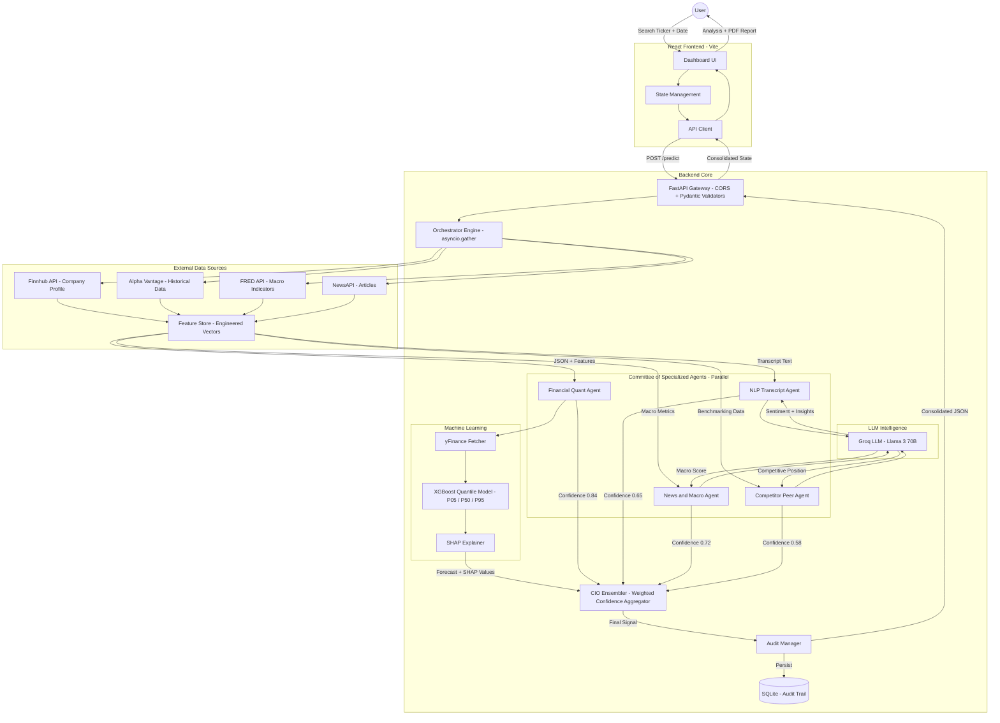

```mermaid
graph TB
    User((User))

    subgraph Frontend["React Frontend - Vite"]
        UI[Dashboard UI]
        State[State Management]
        APIClient[API Client]
    end

    subgraph BackendCore["Backend Core"]
        Gateway[FastAPI Gateway - CORS + Pydantic Validators]
        Orchestrator[Orchestrator Engine - asyncio.gather]

        subgraph CommitteeAgents["Committee of Specialized Agents - Parallel"]
            QuantAgent[Financial Quant Agent]
            NLPAgent[NLP Transcript Agent]
            NewsAgent[News and Macro Agent]
            CompAgent[Competitor Peer Agent]
        end

        subgraph MLLayer["Machine Learning"]
            yFinance[yFinance Fetcher]
            XGBoost[XGBoost Quantile Model - P05 / P50 / P95]
            SHAP[SHAP Explainer]
        end

        subgraph LLMLayer["LLM Intelligence"]
            Groq[Groq LLM - Llama 3 70B]
        end

        Ensembler[CIO Ensembler - Weighted Confidence Aggregator]
        AuditManager[Audit Manager]
        SQLite[(SQLite - Audit Trail)]
    end

    subgraph DataSources["External Data Sources"]
        Finnhub[Finnhub API - Company Profile]
        AlphaV[Alpha Vantage - Historical Data]
        FRED[FRED API - Macro Indicators]
        NewsAPI[NewsAPI - Articles]
        FeatureStore[Feature Store - Engineered Vectors]
    end

    User -->|Search Ticker + Date| UI
    UI --> State
    State --> APIClient
    APIClient -->|POST /predict| Gateway
    Gateway --> Orchestrator

    Orchestrator --> Finnhub
    Orchestrator --> AlphaV
    Orchestrator --> FRED
    Orchestrator --> NewsAPI

    Finnhub --> FeatureStore
    AlphaV --> FeatureStore
    FRED --> FeatureStore
    NewsAPI --> FeatureStore

    FeatureStore -->|JSON + Features| QuantAgent
    FeatureStore -->|Transcript Text| NLPAgent
    FeatureStore -->|Macro Metrics| NewsAgent
    FeatureStore -->|Benchmarking Data| CompAgent

    QuantAgent --> yFinance
    yFinance --> XGBoost
    XGBoost --> SHAP
    SHAP -->|Forecast + SHAP Values| Ensembler

    NLPAgent --> Groq
    NewsAgent --> Groq
    CompAgent --> Groq
    Groq -->|Sentiment + Insights| NLPAgent
    Groq -->|Macro Score| NewsAgent
    Groq -->|Competitive Position| CompAgent

    QuantAgent -->|Confidence 0.84| Ensembler
    NLPAgent -->|Confidence 0.65| Ensembler
    NewsAgent -->|Confidence 0.72| Ensembler
    CompAgent -->|Confidence 0.58| Ensembler

    Ensembler -->|Final Signal| AuditManager
    AuditManager -->|Persist| SQLite
    AuditManager -->|Consolidated JSON| Gateway
    Gateway -->|Consolidated State| APIClient
    APIClient --> UI
    UI -->|Analysis + PDF Report| User
```
