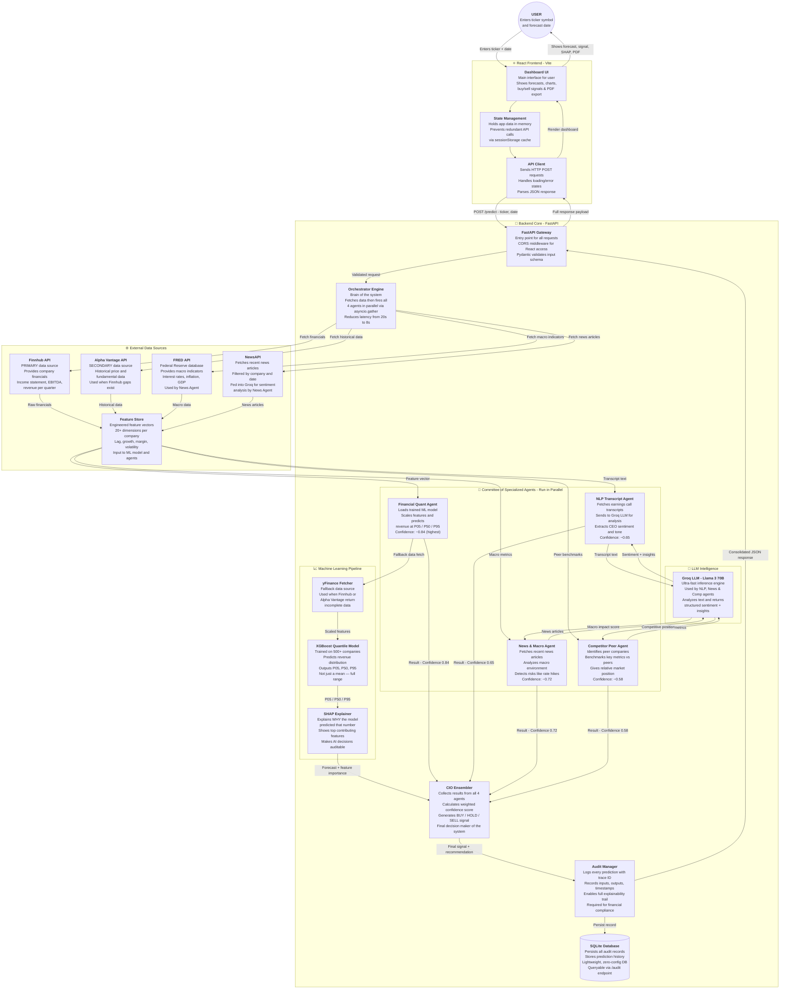

```mermaid
graph TB
    User(("`**USER**
    Enters ticker symbol
    and forecast date`"))

    subgraph Frontend["⚛️ React Frontend - Vite"]
        UI["`**Dashboard UI**
        Main interface for user
        Shows forecasts, charts,
        buy/sell signals & PDF export`"]
        State["`**State Management**
        Holds app data in memory
        Prevents redundant API calls
        via sessionStorage cache`"]
        APIClient["`**API Client**
        Sends HTTP POST requests
        Handles loading/error states
        Parses JSON response`"]
    end

    subgraph BackendCore["🐍 Backend Core - FastAPI"]
        Gateway["`**FastAPI Gateway**
        Entry point for all requests
        CORS middleware for React access
        Pydantic validates input schema`"]
        Orchestrator["`**Orchestrator Engine**
        Brain of the system
        Fetches data then fires all
        4 agents in parallel via asyncio.gather
        Reduces latency from 20s to 8s`"]

        subgraph CommitteeAgents["🤖 Committee of Specialized Agents - Run in Parallel"]
            QuantAgent["`**Financial Quant Agent**
            Loads trained ML model
            Scales features and predicts
            revenue at P05 / P50 / P95
            Confidence: ~0.84 (highest)`"]
            NLPAgent["`**NLP Transcript Agent**
            Fetches earnings call transcripts
            Sends to Groq LLM for analysis
            Extracts CEO sentiment and tone
            Confidence: ~0.65`"]
            NewsAgent["`**News & Macro Agent**
            Fetches recent news articles
            Analyzes macro environment
            Detects risks like rate hikes
            Confidence: ~0.72`"]
            CompAgent["`**Competitor Peer Agent**
            Identifies peer companies
            Benchmarks key metrics vs peers
            Gives relative market position
            Confidence: ~0.58`"]
        end

        subgraph MLLayer["📈 Machine Learning Pipeline"]
            yFinance["`**yFinance Fetcher**
            Fallback data source
            Used when Finnhub or
            Alpha Vantage return
            incomplete data`"]
            XGBoost["`**XGBoost Quantile Model**
            Trained on 500+ companies
            Predicts revenue distribution
            Outputs P05, P50, P95
            Not just a mean — full range`"]
            SHAP["`**SHAP Explainer**
            Explains WHY the model
            predicted that number
            Shows top contributing features
            Makes AI decisions auditable`"]
        end

        subgraph LLMLayer["🧠 LLM Intelligence"]
            Groq["`**Groq LLM - Llama 3 70B**
            Ultra-fast inference engine
            Used by NLP, News & Comp agents
            Analyzes text and returns
            structured sentiment + insights`"]
        end

        Ensembler["`**CIO Ensembler**
        Collects results from all 4 agents
        Calculates weighted confidence score
        Generates BUY / HOLD / SELL signal
        Final decision maker of the system`"]

        AuditManager["`**Audit Manager**
        Logs every prediction with trace ID
        Records inputs, outputs, timestamps
        Enables full explainability trail
        Required for financial compliance`"]

        SQLite[("`**SQLite Database**
        Persists all audit records
        Stores prediction history
        Lightweight, zero-config DB
        Queryable via /audit endpoint`")]
    end

    subgraph DataSources["🌐 External Data Sources"]
        Finnhub["`**Finnhub API**
        PRIMARY data source
        Provides company financials
        Income statement, EBITDA,
        revenue per quarter`"]
        AlphaV["`**Alpha Vantage API**
        SECONDARY data source
        Historical price and
        fundamental data
        Used when Finnhub gaps exist`"]
        FRED["`**FRED API**
        Federal Reserve database
        Provides macro indicators
        Interest rates, inflation, GDP
        Used by News Agent`"]
        NewsAPI["`**NewsAPI**
        Fetches recent news articles
        Filtered by company and date
        Fed into Groq for sentiment
        analysis by News Agent`"]
        FeatureStore["`**Feature Store**
        Engineered feature vectors
        20+ dimensions per company
        Lag, growth, margin, volatility
        Input to ML model and agents`"]
    end

    User -->|"Enters ticker + date"| UI
    UI --> State
    State --> APIClient
    APIClient -->|"POST /predict - ticker, date"| Gateway
    Gateway -->|"Validated request"| Orchestrator

    Orchestrator -->|"Fetch financials"| Finnhub
    Orchestrator -->|"Fetch historical data"| AlphaV
    Orchestrator -->|"Fetch macro indicators"| FRED
    Orchestrator -->|"Fetch news articles"| NewsAPI

    Finnhub -->|"Raw financials"| FeatureStore
    AlphaV -->|"Historical data"| FeatureStore
    FRED -->|"Macro data"| FeatureStore
    NewsAPI -->|"News articles"| FeatureStore

    FeatureStore -->|"Feature vector"| QuantAgent
    FeatureStore -->|"Transcript text"| NLPAgent
    FeatureStore -->|"Macro metrics"| NewsAgent
    FeatureStore -->|"Peer benchmarks"| CompAgent

    QuantAgent -->|"Fallback data fetch"| yFinance
    yFinance -->|"Scaled features"| XGBoost
    XGBoost -->|"P05 / P50 / P95"| SHAP
    SHAP -->|"Forecast + feature importance"| Ensembler

    NLPAgent -->|"Transcript text"| Groq
    NewsAgent -->|"News articles"| Groq
    CompAgent -->|"Peer metrics"| Groq
    Groq -->|"Sentiment + insights"| NLPAgent
    Groq -->|"Macro impact score"| NewsAgent
    Groq -->|"Competitive position"| CompAgent

    QuantAgent -->|"Result - Confidence 0.84"| Ensembler
    NLPAgent -->|"Result - Confidence 0.65"| Ensembler
    NewsAgent -->|"Result - Confidence 0.72"| Ensembler
    CompAgent -->|"Result - Confidence 0.58"| Ensembler

    Ensembler -->|"Final signal + recommendation"| AuditManager
    AuditManager -->|"Persist record"| SQLite
    AuditManager -->|"Consolidated JSON response"| Gateway
    Gateway -->|"Full response payload"| APIClient
    APIClient -->|"Render dashboard"| UI
    UI -->|"Shows forecast, signal, SHAP, PDF"| User
```
